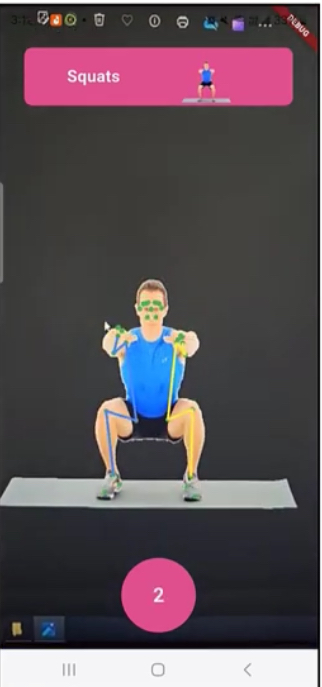
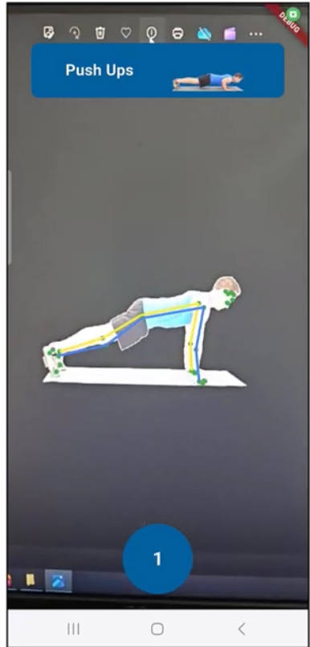

# PoseDetection – AI Workout App

## Overview
PoseDetection is an Android application that uses **Google ML Kit Pose Detection** to track human body movements in real time.  
It analyzes exercise form, counts repetitions, and provides visual feedback to help users perform workouts correctly.


---


## Features
- Real-time pose detection with ML Kit  
- Exercise selection screen (Push Ups, Squats, Plank to Downward Dog, Jumping Jack)  
- Skeleton overlay drawn on top of the camera feed  
- Repetition counting for supported exercises  
- Form feedback – displays tips if movements are incorrect  
- Runs fully on-device – no internet connection required


---


## Project Structure
poseDetection/
└── app/
├── src/main/java/com/example/posedetection/
│ ├── MainActivity.kt # Camera + activity entry point
│ ├── PoseDetector.kt # ML Kit pose detection
│ ├── PoseOverlay.kt # Skeleton drawing on Canvas
│ └── ExerciseLogic.kt # Repetition counting & feedback
├── res/ # Layouts, drawables, strings
└── AndroidManifest.xml # Permissions and app config


---


## Installation
1. Clone the repository:
   ```bash
   git clone https://github.com/iremolcun/poseDetection.git
2. Open the project in Android Studio.

3. Run a Gradle Sync.

4. Connect a physical Android device (recommended) or start an emulator.

5. Build and run the app.

6. Required permission:

   android.permission.CAMERA

---

Usage
1. Launch the app.

2. Choose an exercise from the menu (e.g., Push Ups).

3. Position yourself in front of the camera.

4. The app will draw skeleton keypoints, count repetitions, and provide feedback.

---

Screenshots
<p align="center">    </p>


---


Technologies
Kotlin + Java (Android)

Google ML Kit – Pose Detection API

CameraX (camera stream)

Canvas overlay (skeleton drawing)
